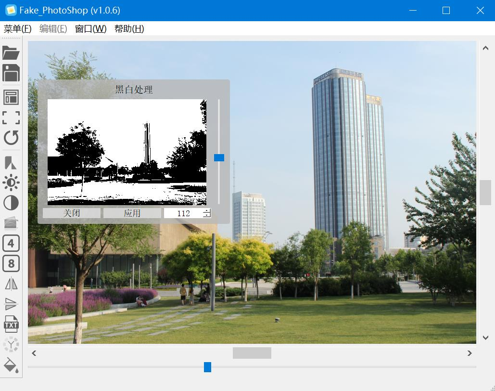

# Fake_PhotoShop

几个月前练手写的简易图形界面小程序，利用了Qt库。由于一些限制，不得不在Qt程序中调用外部的exe。

## 如何从源码编译运行 - 共 4 步

#### 1. 编译 outsideEXE_FPS.exe

将“SourceCode_outsideEXE”文件夹中的源码静态编译为`outsideEXE_FPS.exe`。

#### 2. 用 Qt 编译主要源代码

例如在 QtCreator 中打开项目`fake_PhotoShop.pro`并构建。构建成功后，将`README.txt`、`初始化软件.bat`、`outsideEXE_FPS.exe`置于`fake_PhotoShop.exe`的工作目录。

#### 3. 运行前的准备

运行`fake_PhotoShop.exe`前，先执行`初始化软件.bat`，这将在目录中创建`cmd_copy.exe`。

#### 4. 开始运行

打开 `fake_PhotoShop.exe`，你将看到下面的界面。

Author: Clarenous

Date: 2017.12.30
